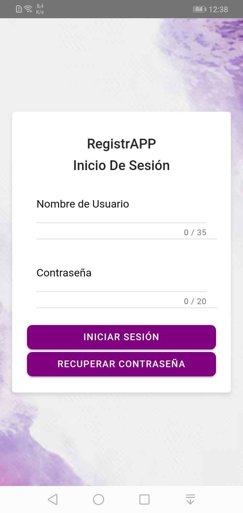

# RegistrApp

RegistrApp es una aplicación desarrollada para simplificar el paso de la asistencia en la sala de clases. El docente crea un código QR de la clase para que los alumnos lo escaneen a través de RegistrApp y así registren su asistencia.

---

## Instrucciones para ingresar a la aplicación RegistrApp

1. Desde la sección [Releases](https://github.com/belruz/Proyecto_RegistrApp/releases/tag/v2.0.1), descarga el archivo APK.  
2. Instálalo en tu dispositivo Android.  
3. Ingresa tus credenciales para ingresar como **docente** o **alumno**.  

---

## Funciones principales para el alumno

1. **Login**
   

2.  **Vista de cursos inscritos y escanear QR**

3. **Ver detalles del curso y reportar inasistencia**

4. **Perfil de estudiante y cambio de contraseña**

---

## Funciones principales para docente

1. **Login**
      

3. **Vista de cursos impartidos y crear nuevo curso**   

6. **Crear nueva clase y anuncio**  

8. **Ver detalles de la clase**

10. **Perfil de docente y cambio de contraseña**

6. **Generar QR**

